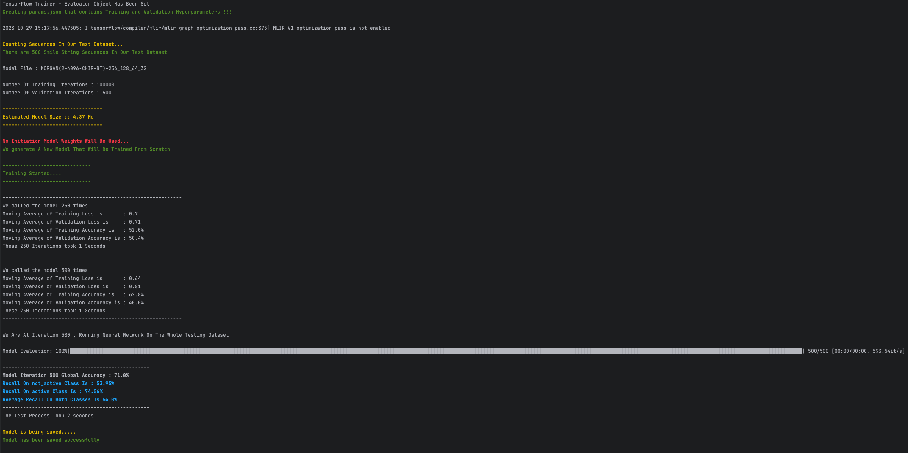
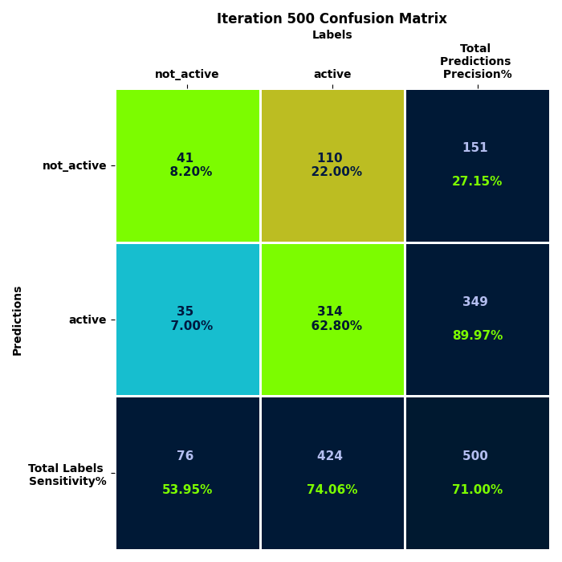

# Molecule Property Predictor

The following repository is a classification library intended to train, evaluate and predict molecule properties.

* [Molecule Property Predictor](#molecule-property-predictor)
   * [Installation](#installation)
      * [Using Docker](#using-docker)
      * [Without Using Docker](#without-using-docker)
   * [Training, Evaluation And Prediction](#training-evaluation-and-prediction)
      * [Description of the configuration file](#description-of-the-configuration-file)
      * [Training A Model](#training-a-model)
      * [Evaluating A Model](#evaluating-a-model)
      * [Prediction of a Smile String For A Specific Model](#prediction-of-a-smile-string-for-a-specific-model)
   * [Flask Application](#flask-application)
   * [Common errors](#common-errors)

## Installation
The installation and usage of the library can be done in two manners, with or without docker.


### Using Docker
The image that will be used to create containers needs to be created. You can use the Dockerfile in the following manner.

```sh
# Build a docker image that will be named servier
docker build -t servier .
```

Once the installation is done you run a container with the adequate volumes and ports pre-configured using docker compose.

```sh
# Run the container using docker compose
docker compose run --service-ports servier

# Use the poetry environment installed during the image's creation ( Equivalent of activating a virtual environment with conda or pip )
poetry shell
```

### Without Using Docker
You will need the following requirements : 
- pyenv : Python Version management Tool that allows to quickly install and swith python versions
  - Installation Link : https://github.com/pyenv/pyenv
- poetry : Dependency Management and Packaging Tool
  - Installation Link : https://python-poetry.org/docs/

Once you have both poetry and pyenv installed, you will need to install the desired python version and all the adequate dependencies.
```sh
# Download python 3.10.10
pyenv install 3.10.10

# Install python packages
# Specify the version of python that you would like poetry to use
pyenv shell 3.10.10 # Current terminal's default version is set to 3.10.10
poetry env use 3.10.10
poetry install

# Use the poetry environment installed during the image's creation ( Equivalent of activating a virtual environment with conda or pip )
poetry shell
```

## Training, Evaluation And Prediction

There are three important folders that structure every training, evaluation or prediction process.
- _**data**_ folder
- _**config**_ folder
- _**trained_models**_ folder

To set up the parameters of the architectures that will be used as well as the preprocessing of data, we will use configuration files.
These configuration files can be found under the _**config**_ folder. During the training process, models might be saved at a defined iteration step.
These models will be stored under _**trained_models**_ folder. The Data that is used for training, validation and testing can be found under the _**data**_ folder.

### Description of the configuration file
If one wishes to train a new architecture, copy the _**project_config.example.yml**_ file and change the name to an experiment_name.

```sh
# Copy the project_config.example.yml file
cp config/project_config.example.yml config/{your_experiment_name}.yml
```

Specify the name of the folder using _project_folder_. This folder will be stored under _**trained_models**_.
Specify the data that you would want to use in the _data_files_ section.
NOTE: Save your csv data files in the _**data**_ folder, since this is where the application will search for them.
```yml
folder_structure:
    # Path to folder where Model Training and Validation Information is stored.
    project_folder: "v1"
    
    # Path of the csv files where data is stored [ Path is referenced from data folder ]
    # Important : If the absolute paths is "/home/molecule-properties/data/single/train.csv"
    # You should only specify "single/train.csv"
    data_files:
        train: "single/train.csv"
        validation: "single/valid.csv"
        test: "single/test.csv"
```

If one wishes to launch a model that does multilabel prediction. You can specify it under (keep in mind that this is linked to the data that was defined previously):
```yml
multiple_property_prediction:
    activated: True # Boolean that indicates that we want P1, P2, P3, P4 ...,
    number_of_prediction_columns: 9 # Number Of Columns that interest us
```

Specifications on the type of pre-processing that one want to use can be done under _fingerprint_. Currently, there only two types of preprocessing.
The first one is the morgan fingerprint, can be used by specifying _activated_ as **True** and type as **morgan**. The second preprocessing type is a naive one hot encoder.
The naive one hot encoder can be used by setting the _activated_ field under _fingerprint_ to **False**.

```yml
fingerprint:
    activated: True # Set to False in order to use the naive one hot vector encoding
    type: "morgan"
    parameters:
        morgan:
            radius: 2
            size: 4096
            use_chirality: True
            use_bond_types: True
            use_features: False
```

Specifications of the architecture are set as shown below. If one does not use fingerprints an aggregation step will be used in order to transform
data that was a sequence ( sequence of smile string characters ) to one vector that always has the same dimension. Once we have input that always has the same dimension,
this input is then fed to multiple fully connected layers.
```yml
model:
    # Preprocessing in order to account for the model that takes one hot sequence rather than the morgan fingerprint
    aggregation:
        type: "blstm" # must be a value in ["blstm"]
        parameters:
            # Bi-LSTM Parameters
            blstm:
                number_of_hidden_units: 100
                number_of_layers: 2
                number_of_matrices: 4
                
    fully_connected_sizes: [256,128,64,32] # Number of neurons in fully connected matrices
```

### Training A Model
To train a model, once you have specified your parameters in the configuration file you can launch it using the following command

```sh
# if you have a configuration file named v2.yml 
python servier/main.py --train --config=v2.yml
```

The output should look something like this.
<div align="center">
  
</div>

At a given step, here each 500 steps, evaluation is launched on the test set. And metrics are produces and displayed in the terminal.
These metrics can also be found in a confusion matrix image that can should look something like this.
<div align="center">
  
</div>

Result files will be stored under _**trained_models**_ folder under the folder with the experiment name that you previously set.
Here in our case it should be under the folder **_v2_**. You should also be able to find the weights of the model in the same folder.

### Evaluating A Model

Once a model is trained and you have a dastaset that you would like to test on, it can be done by setting the test file in the configuration file.
Then you can launch evaluation on the model that interest you the most by running the following command.
Note : You have to specify the index of the iteration that is of interest to you.

```sh
# if you have a configuration file named v2.yml 
python servier/main.py --evaluate --index=500 --config=v2.yml
```

### Prediction of a Smile String For A Specific Model
One can launch prediction of a specific model like shown below. Here we are using the model that was saved at iteration 500,
under the v2 configuration and the smile string that we would like to predict is **_Cc1cccc(N2CCN(C(=O)C34CC5CC(CC(C5)C3)C4)CC2)c1C_**

```sh
python servier/main.py --predict --index=500 --config=v2.yml --smile='Cc1cccc(N2CCN(C(=O)C34CC5CC(CC(C5)C3)C4)CC2)c1C'
```

## Flask Application
In order to run the Flask application for prediction just launch the following script.
```sh
# The port of communication with the application is 8080
python servier/run.py --index=500 --config=v2.yml
```

## Common errors
```
import tensorflow as tf
ModuleNotFoundError: No module named 'tensorflow'
```
Despite having Tensorflow installed, this error can arise for some specific hardware, requiring a specific type of tensorflow. To correct it just run :

```sh
poetry run pip install tensorflow==2.13.0

# Output should look something like this
# Installing collected packages: tensorflow-macos, tensorflow
# Successfully installed tensorflow-2.13.0 tensorflow-macos-2.13.0
```
